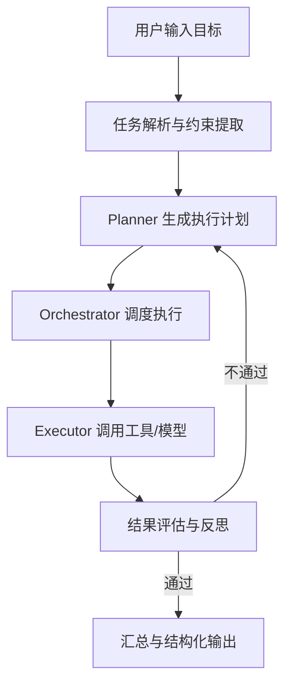
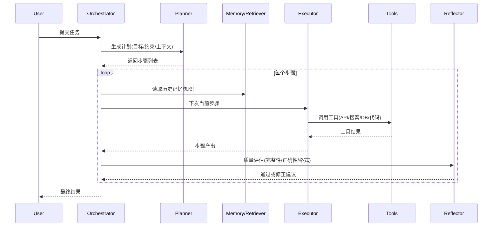

# 02｜agents 运行逻辑与流程图

这一章是全书最关键的一章：你会看到一个任务从进入系统到输出结果的完整链路。

## 1. 高层流程（宏观）

### 通俗解释

- Planner 像“项目经理”：决定先做什么后做什么。
- Orchestrator 像“调度中枢”：盯住流程和状态。
- Executor 像“执行团队”：真的去搜、算、查、写。
- Reflection 像“质检员”：检查结果是否达标。

---

## 2. 细粒度时序（微观）

---

## 3. 关键状态机（执行生命周期）

常见状态：

- `PENDING`：待执行
- `RUNNING`：执行中
- `SUCCESS`：成功
- `FAILED`：失败
- `RETRYING`：重试中
- `BLOCKED`：阻塞（例如缺少凭证）

为什么要状态机？

- 便于恢复（断点续跑）
- 便于监控（知道卡在哪）
- 便于重试（仅重跑失败步骤）

---

## 4. 三条必须理解的“流”

1. **控制流**：谁决定下一步做什么。
2. **数据流**：每一步输入输出怎么传递。
3. **反馈流**：失败如何回到计划层修正。

只要你把这三条流看清楚，整个 Agent 系统就不再神秘。

---

## 5. 教学拆解：一次任务真实会经历什么

下面把“用户给一个复杂任务”拆成 8 个教学观察点：

1. **目标标准化**：把自然语言需求转成结构化约束（输出格式、范围、时限、必须引用）。
2. **计划生成**：先给步骤，再给每步验收标准（done_when）。
3. **上下文注入**：把历史记忆、检索证据、用户偏好注入当前步骤。
4. **执行与调用**：每步选择模型或工具，并记录参数与耗时。
5. **结果验证**：检查格式、完整性、事实依据。
6. **失败处理**：重试、降级、重规划（三选一或组合）。
7. **全局汇总**：把步骤产出整合为最终答案（并去重、统一术语）。
8. **可观测沉淀**：日志、指标、事件链条用于后续复盘。

> 学习建议：你每看完一章，都回来对照这 8 点，看看自己已经掌握到哪一步。

---

## 6. 常见误区（非常关键）

### 误区 1：把 Planner 当“结果生成器”

Planner 的主要产物不是答案，而是“可执行计划”。

### 误区 2：把 Orchestrator 当“for 循环”

生产级编排不只是顺序执行，还要处理并发、状态持久化、失败恢复。

### 误区 3：把 Reflection 当“可有可无”

没有质检环节，系统会在复杂任务中快速失真。

---

## 7. 章节练习（建议动手）

题目：给需求“分析竞品功能并输出路线图”，请你写出：

1. 一个 4 步计划（每步有 done_when）。
2. 一个最小状态机（至少含 SUCCESS/FAILED/RETRYING）。
3. 一个失败回路（例如检索失败后如何补救）。

如果你能独立写出来，就说明你已经掌握了 Agent 运行主链路。
